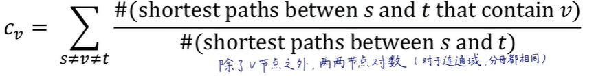
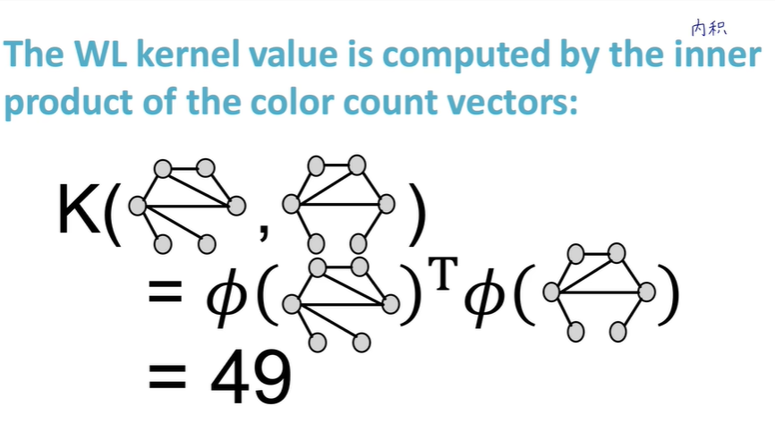

## 1.1 Why Graph

- 如何利用图这种关系结构做出更准确的预测
- 图可以表示的领域：自然图、信息图
- 难点：没有固定搜索方向、多模态、动态
- 不关注特征设计，用演示学习Representation Learning
- 传统方法： Graphlets图基元、Graph Kernels图核
- 通用节点嵌入： DeepWalk、Node2Vec
- 图神经网络： GCN、GraphSAGE、GAT、Theory of GNNs
- 异构图、知识图；TransE、BetaE

## 1.2 图机器学习的应用

不同类型的任务：     

1. node：点分类（预测点的特性，例如：用户分类）     
2. edge：链接预测（预测两个点之间是否存在遗漏的链接，例如完成知识图谱 knowledge graph）     
3. community（subgraph）：图分类（例如：分子性质预测）；clustering 分类归并（判断点是否属于子图，例如：社交圈探测）     
4. graph：图预测、图生成（例如：药物发现）、图演化（例如：物理仿真）

应用：
- Node- level的例子：蛋白质折叠
    根据蛋白质的氨基酸序列预测蛋白质的3D结构
    AlaphFold解决了这个问题
    关键思想：空间图，节点为蛋白质序列中的氨基酸，边为氨基酸的邻近度。

- edge- level的例子：推荐系统
    点：用户和项目（商品、音乐、电影等）
    边：用户和项目的交互关系
    任务：推荐用户可能感兴趣的项目

- edge-level的例子：药物副作用
    任务：根据给出的药物预测有害的副作用
    点：药物和蛋白质
    边：药物对特定蛋白质的影响&蛋白质之间的相互作用

- subgraph-level的例子：地图路线预测
    节点：路段
    边：路段之间的连通性

- 药物发现：
    抗生素是小分子图，节点是原子，边是化学键

- 生成新分子/最优化
- 物理仿真

## 1.3 一些图的概念（图论）
有向图/无向图、二部图、完全图、连通图/强连通图、邻接矩阵

## 2.1 传统图机器学习的特征工程--节点
**概述**：特征工程：用于将图的节点/连接/子图/全图转化成d维向量，输入传统机器学习模型。每一个特征就是这个d维向量的一个维度。特征分为属性特征（eg.用户节点的类型...）和连接特征，以下所写都为连接特征。

1. **Node degree 节点度数**
    邻接矩阵按行或按列求和，即邻接矩阵乘以全为1的列向量

2. **Node centrality 节点重要度**
    1. **Eigenvector centrality**
    一个节点的重要度等于它的邻接节点的重要度求和再除以一个常数
    计算方法：
    
    

    2. **Betweenness centrality**
    一个节点位于越多对节点的最短路上说明它越重要。用于衡量一个节点是否处于交通要道上。
    

    3. **Closeness centrality**
    一个节点到其它所有节点的最短路长度越小说明它越重要。
    

3. **Clustering coefficient 集群系数**

4. **Graphlets**
非同型子图，类似同分异构体

Graphlet degree vector （GDV）用于描述节点周围的拓扑结构信息。

## 2.2 传统图机器学习的特征工程--连接
**任务：Link Prediction**
1. 静态图随机缺失的连接： eg.蛋白质图缺失部分氨基酸连接
2. 动态图连接预测： 给出一段时间的图，预测下一段时间的图的连接，比较预测的连接和下一个时间段的真实连接 eg.社交网络、论文引用

**解决 Link Prediction 任务的步骤**
1. 提取连接的特征转化为d维向量
2. 输入机器学习算法，得到c(x,y)
3. 给c(x,y)降序排序，选出最好的n个预测结果
4. 将选出的结果与真实结果比较，判断算法好坏

**连接的特征**
1. Distance-based feature
最短路径长度

2. Local neighborhood overlap
    - 共同好友个数
    - Jaccard's coefficient 两节点的邻接节点交并比
    - Adamic-Adar index 两节点共同的邻接节点的连接数
    
如果两个节点之间没有共同的邻接节点，那么这个特征就不可靠

3. Global neighborhood overlap
    - Katz index ：节点u和节点v之间长度为k的路径个数
    用邻接矩阵的k次幂计算

## 2.3 传统图机器学习的特征工程--全图
Bag-of-*(*为任意一种特征)，向量某个维度的数值为对应的特征在图中出现的次数，由此将图转化为d维向量。

**Graphlet Kernel**
用于衡量两个图是否相似
计算方法：

问题：如果两个图大小不一样？
解决：对图的 Graphlets count vector 做归一化

局限性：找全图的 Graphlets 算法复杂度太大

**Weisfeiler-Lehman Kernel**
相较于前者更高效

总结：

## 3.1 Node Embeddings 图嵌入
如何把节点/边/子图/全图映射成d维向量？
1. 人工特征工程： 节点重要度、集群系数、Graphlets
2. 图表示学习： 通过随机游走构造自监督学习任务。DeepWalk、Node2Vec
3. 矩阵分解
4. 深度学习： 图神经网络

对节点的图表示学习，要求生成的d维向量是低维（维度小于图中节点个数）、连续（每个元素都是实数）、稠密的。向量的相似度可以反应节点的相似度。

图嵌入框架： 编码器-解码器
编码器：输入节点，输出节点的向量
解码器：两个节点的向量点乘得到的余弦相似度能够反应图中节点的相似度
如何定义两节点相似：它们出现在同一个随机游走序列中
最简单的编码器：查表，也就是浅编码器。Z矩阵一列表示一个节点，一列中每行的数值表示向量的维度。迭代优化Z矩阵使得解码器的目标能够实现。

**基于随机游走的图嵌入**
P(v|Zu)为从u节点出发随机游走到v节点的概率，计算这个概率的方法为softmax。

步骤：
1. 采样得到若干随机游走序列，计算P
2. 迭代优化每个节点的d维向量，使得序列中共现节点的向量数量积大，不共现节点的向量数量积小

如何迭代优化：极大似然估计，N为从u节点出发的随机游走序列经过的节点

损失函数：

优化问题就是最小化损失函数L，但是这个L有两处需要遍历所有节点，复杂度大。为了降低复杂度，我们采用负采样方法。

k越大，理论上鲁棒性越好，但是k越大可能出现正负样本不均衡问题，所以k一般取5到20。

**随机梯度下降**
- 全局梯度下降：不震荡
- 对每个随机游走序列梯度下降：很震荡
- mini-batch SGD：对一批随机游走序列梯度下降，最常用且不那么震荡

**Node2Vec**
前面的随机游走策略是完全随机的，现在我们试图优化一下随机游走策略。
有偏的二阶随机游走：通过p、q两个超参数控制BFS（宽度优先，反应节点的角色功能：桥接/中枢/边缘）和DFS（深度优先，同质社群）的倾向。所谓二阶，就是每个节点都记着上一个节点

步骤：
1. 计算每一个边的权重和概率
2. 生成 r 个随机游走序列：以 u 为起始节点，长度为 l 
3. 通过随机梯度下降优化 Z 表

三个步骤可以并行

## 3.2 整张图的嵌入
**方法一：直接对所有节点嵌入求和，作为图的嵌入**

**方法二：引入虚拟节点**
这个虚拟节点与所研究的图或子图中的所有节点直接相连，以这个虚拟节点的嵌入作为图或子图的嵌入

**方法三：匿名随机游走嵌入**
每次见到不同节点就发一个新编号

需要采样多少次随机游走？

## 4 PageRank
网络是有向图
每个网页的重要程度是不一样的，搜索引擎要给网页的重要程度排序
PageRank是根据连接评价节点重要度的方法
PageRank有3种，后面两种是计算节点相似度的，常用于推荐系统：
1. PageRank 
2. Personalized PageRank
3. Random Walk with Restarts

**从迭代求解线性方程组角度理解PageRank**
如下图所示，j节点的重要度由引用了j节点的i、k节点决定，权重由i、k节点的引用次数决定，计算方式如下。

下面是一个求解节点重要度的例子

局限性：如果有很多个节点，需要联立很多个方程组求解，十分麻烦。

**从迭代左乘M矩阵角度理解PageRank**
M矩阵是Stochastic adjacency matrix，可以叫做概率矩阵、转移矩阵、替代矩阵。
下面是一个例子，左边的矩阵就是M矩阵，它的每一列求和为1，它的第 i 列第 j 行不为0表示 i 节点指向 j 节点，分母是 i 节点的出度。

那么，迭代过程就从前面的求解方程组变成左乘M矩阵。（右边的矩阵为初始化的PageRank，每个节点的重要度都是一样的）

**从矩阵的特征向量角度理解PageRank**
不断地左乘M矩阵最后会使PageRank收敛到M矩阵的主特征向量

**随机游走得到PageRank**
一个浏览者在很多网页构成的图里顺着out-link随机游走，将随机游走中的网页访问次数归一化得到PageRank。
每一次随机游走就是一次迭代，得到的计算方式和上面左乘M矩阵的一样。

另外，也可以用马尔科夫链求解PageRank。

**真正的求解PageRank的方式**
就是迭代左乘M矩阵。
其它方法复杂度大或者要模拟很多次随机游走。
具体的计算方式：初始化、迭代、直至收敛

PageRank能够收敛的要求：网络图是连通图、没有无出度的节点或子图
为了满足上面的要求，PageRank算法设置了在随机游走过程中，游走的指针有一定概率被传送到任意一个节点。改写M矩阵，使得“死胡同”节点一定会传送到任一节点，传送到每个节点的概率相等。计算方式如下，（1-β）为被传送走的概率。

M矩阵改写成谷歌矩阵G

**PageRank用于求解节点相似度**
目标：寻找与指定节点最相似的节点
- 随机传送到**任意**节点是PageRank 
- 随机传送到指定的**一些**节点是Personalized PageRank
- 随机传送到指定的**一个**节点是Random Walk with Restarts
从指定的Q节点出发，随机游走并记录每个节点访问次数，游走时有一定概率传送回Q节点

## 5 Label Propagation for Node Classification 半监督节点分类（标签传播）
label为0或者1。因为是半监督学习，所以只有一部分节点有label。
标签传播是利用周围节点信息猜测无label的节点信息，无法泛化到新出现的节点。这一类的算法常作为baseline。

**Label Propagation**
初始化：对于已知节点的label设为0或1，对未知节点的label设0.5
迭代：未知节点的label为邻接节点的label加权平均
预测：未知节点的label值收敛后，大于0.5的label预测为1，小于0.5的label预测为0

**Iterative Classification**
前一种分类方法未考虑节点网络连接特征，这种分类方法既要考虑节点属性特征，又要考虑节点的连接特征。
训练2个分类器

步骤：
1. 用已标注好的数据作为训练集，训练这两个分类器
2. 先用分类器1预测测试集的节点属性，计算得到 Zv
3. 使用分类器2预测，迭代更新测试集的节点属性特征
4. 直到收敛或者达到最大迭代次数（这个过程不保证收敛）

一个例子：

**Correct & Smooth**
步骤：
1. 在训练集上训练一个基础的分类器（这个分类器是什么都可以）
2. 用这个分类器预测所有节点的结果soft label（是两个数，表示label为0的概率和label为1的概率）
3. **后处理**：
    - ***correct step***：让预测的不确定性分散
    计算误差：
    
    迭代误差矩阵E：（类似PageRank）
    
    

    - ***smooth step***：让预测结果平滑
    对于已标注的节点label依旧为非0即1，对于未标注的节点采用correct step得到的soft label
    迭代置信度矩阵Z
    

**Loopy Belief Propagation**
利用节点间的消息传递
Label-label potential matrix 矩阵：表示邻居节点i为Yi类别时，节点j为Yj类别的概率。反映了节点和其邻居的依赖关系。我们需要训练得到这个矩阵。

Prior belief：表示节点i为Yi类别的概率

表示节点i认为节点j是Yj的概率。

计算i对j的猜测的方法 Loopy Belief Propagation：
红框和蓝框部分与j无关：红框与i自己有关，蓝框与i的邻居对i的评价有关
对每个节点迭代运算这个算法

但是对于有环图，传递的信息不独立了（也就在环里的信息包含了其他节点的信息）

**Masked Label Prediction**
把已标注的部分label设为0，用其它label预测这些label，构造自监督学习场景，迭代优化。

## 6 GNN

算法的输入：
- 为什么邻接矩阵不可行？
    因为邻接矩阵的列列交换或者行行交换，表示的还是同一个图，但是算法只认识学习过的图，无法泛化到进行过行列交换后的图。

因此，点和边使用标量存储，一个点or边对应一个标量，图用邻接列表存储，邻接列表是很多个二维向量（表示两个节点相连）。

**GNN的定义**
对图上所有的属性（点、边、图的上下文）进行的可以优化的变换，这个变换可以保持图的对称信息（也就是说，对顶点进行另一个排序之后的输入产生的结果不变）

**GNN的特征**
框架：信息传递
GNN的输入输出都是图

**GNN一个简单示例**
1. 输入一个图。
2. 进入一系列GNN层，每个层里有3个MLP（多层感知机），对应点向量、边向量、全局图向量。此时，输出的图的连接关系没有发生变化，但是属性发生了变化。
3. 如果想要预测的点没有对应的向量，使用pooling汇聚技术。对于没有向量的点，可以使用它的所有邻接节点与全局的向量之和做为这个节点的向量（如果大小不一样要做归一化）。也可以用边的向量汇聚得到顶点的向量，反过来也行。汇聚的操作除了求和还有求平均值和最大值。
4. 进入合适的输出层。例如，二分类问题预测用户节点支持哪个竞选人，可以加一个输出维度为2的全连接层和softmax。
5. 得到预测结果

局限性：没有考虑图的连接信息

**对上面示例的一个改进**
信息传递：在进行步骤2之前，先进行一次汇聚，使输入的节点/边的信息包含邻接节点/邻接边的信息，得到的新的向量作为MLP的输入。当然也可以进行很多次汇聚，使一个节点包含邻居的邻居的邻居...的信息。

**GNN的一种特殊类型GCN**
问题：如果A是网红，B是网友，B只认识A，但是A认识很多人。如果像上述汇聚操作将A的属性直接传递给B，这显然是不合适的。因此，我们要在汇聚时给B节点加上B自己的特征，也就是拉普拉斯变换。

下面是一个例子，A是邻接矩阵加上单位阵（也就是节点自己的信息），D的对角线上的值为A按行求和，也就是对应节点的度数加1。右边的是用于计算变换后的节点的特征的公式，按照上面的问题理解，也就是网红认识的人越多，网红的特征传递给网友的越少。

GNN和GCN的区别在于汇聚这一步骤。